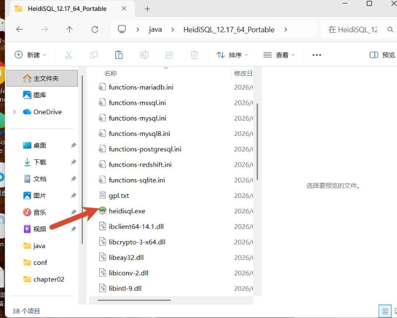

你有没有idea的

zookeeper的这个

apache-
zookeeper-..-bin.ip

redis这个
Redis-x64-3.2.100.zip

你这个只需要开项目10  chapter10就行，前面9个不用管前面九个是这第十个的一部分，运行第十个就行
源代码.zip
148.4M未下载微信网页版
咕嚕
数据库代码.zip
7.5K未下载微信网页版
咕噜
HeidiSQL_12.17_64_ Portable.zip
28.3M未下载微信网页版

你不开你的mysql也可以开这个这个不用安装

我用trae给我改，改的拉完了，一点交互性没，跑的又久

点进去一堆bug

